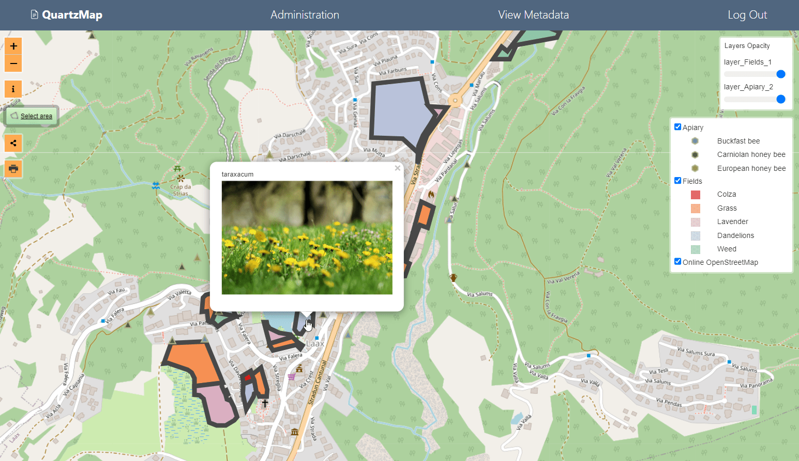

# QuartzMap Web Client

[](https://quartzmap.docs.acugis.com/en/latest/?badge=latest)

## Transform your qgis2web maps into secure, dyanmic maps.  

QuartzMap allows you to transform your qgis2web maps into secure, dynamic maps.  

QuartzMap now also includes support for R apps as well.




- QuartzMap Features

	- Publish Using qgis2web Plugin
	- Private and Public Maps
	- Connect Layers to PostGIS
	- Connect Layers to GeoServer
	- QGIS Print Layouts (or basic Browser Print)
	- Advertise WMS, WFS, WMTS, etc...	
	- Info Box
	- Opacity Controls
	- Customizable Portal
	- Users and Groups
	- Map Level permissions
	- Multi-User Portal
 	- Optional self-registration
	- Publish qgis2threejs (Static Only)
	- R
   
## Install

Requirements:
Ubuntu 24
2 GB RAM (4 GB RAM if installinf Demo Data)
15 GB Disk

Be sure to set the hostname prior to installation if you plan to provision SSL using certbot.

hostnamectl set-hostname qpod.webgis1.com

```bash
$ unzip -q quartzmap-web-client-2.1.0.zip
$ cd quartzmap-web-client-2.1.0
$ ./installer/postgres.sh
$ ./installer/app-install.sh
```

Optionally, provision and SSL certificate using:

```bash
 certbot --apache --agree-tos --email hostmaster@${HNAME} --no-eff-email -d ${HNAME}
```

Note: If using git clone, you will need to make postgres.sh and app-install.sh executable.
 
## Documentation

QuartMap Web Client [Documentation](https://quartzmap.docs.acugis.com).


## License
Version: MPL 2.0

The contents of this file are subject to the Mozilla Public License Version 2.0 (the "License"); you may not use this file except in compliance with the License. 

You may obtain a copy of the License at http://www.mozilla.org/MPL/
